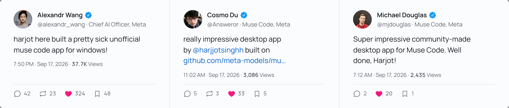
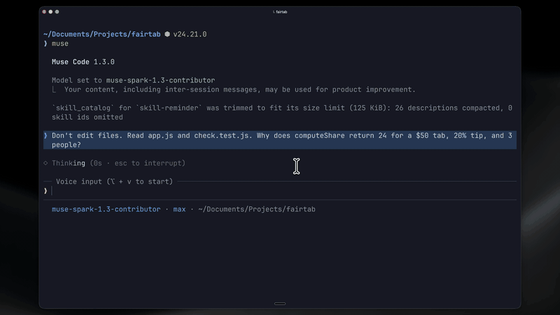
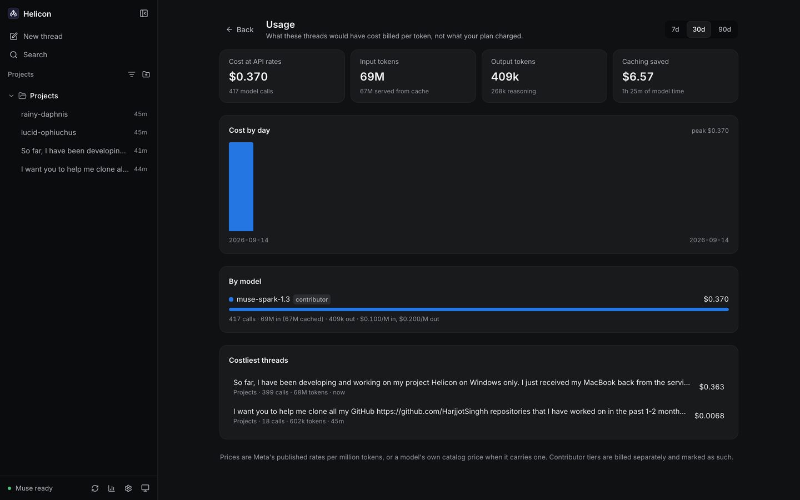
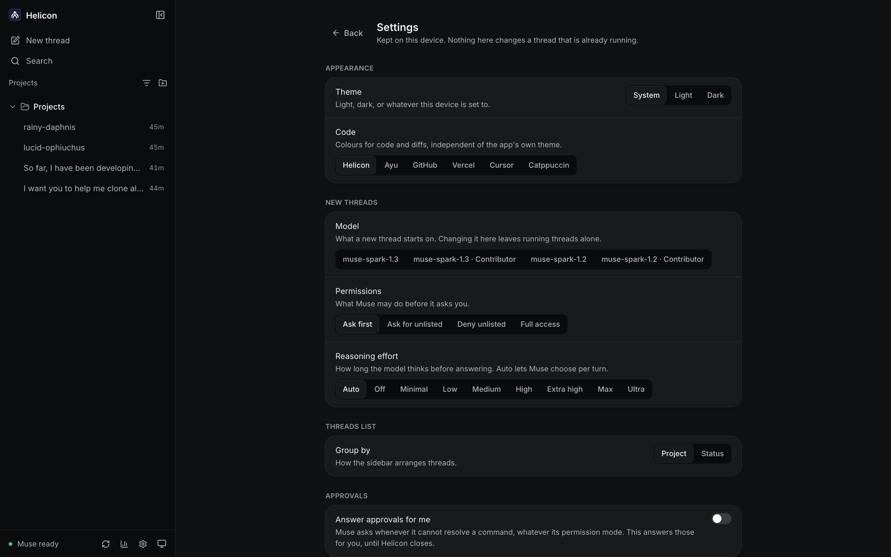
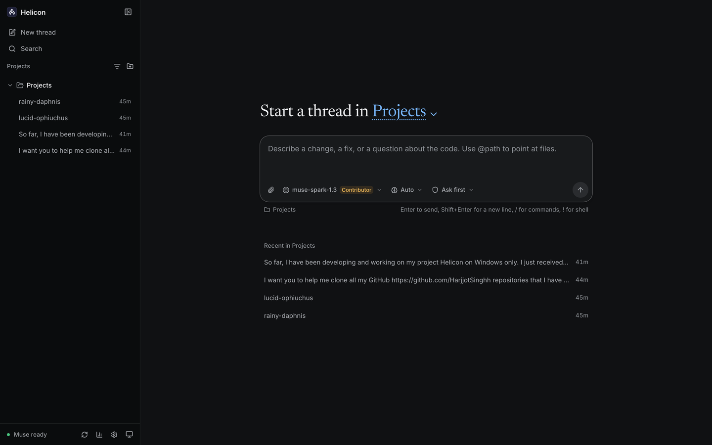
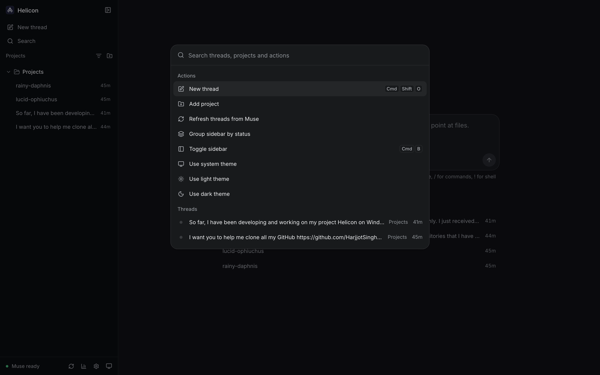

# Helicon

[](LICENSE)
[](https://github.com/HarjjotSinghh/helicon/releases/latest)
[](https://tauri.app)
[](#architecture)
[-0668E1.svg)](https://developer.meta.com/ai/products/muse-code)
[](https://github.com/HarjjotSinghh/helicon/graphs/contributors)
[](https://github.com/HarjjotSinghh/helicon/releases)
[](https://github.com/HarjjotSinghh/helicon/releases/latest)
[](https://github.com/HarjjotSinghh/helicon/stargazers)

<picture>
  <source media="(prefers-color-scheme: dark)" srcset="docs/assets/readme-hero-dark.png" />
  <source media="(prefers-color-scheme: light)" srcset="docs/assets/readme-hero-light.png" />
  
</picture>

> **Helicon** - home of the Muses. An open-source desktop + web ADE for Meta's **Muse Code CLI** (`muse`), in the spirit of the Claude Code desktop app and the Codex / ChatGPT desktop app.

### Shared on X

<picture>
  <source media="(prefers-color-scheme: dark)" srcset="docs/assets/social-proof-dark.png" />
  <source media="(prefers-color-scheme: light)" srcset="docs/assets/social-proof-light.png" />
  
</picture>

The posts: [Alexandr Wang](https://x.com/alexandr_wang/status/2100590733627715684) · [Cosmo Du](https://x.com/Answeror/status/2100457921113170092) · [Michael Douglas](https://x.com/mjdouglas/status/2100399865562059121). Helicon is an unofficial community project: Meta has not endorsed it, and it is not affiliated with Meta.

**Sidebar-first:** all projects grouped by working directory, each with its tasks and sessions - resume anything, including sessions started from the `muse` terminal TUI.

[](https://helicon.sh)

<details>
<summary>Usage and settings</summary>





</details>

> ⚠️ **Unofficial community project.** Not made, endorsed, or supported by Meta. "Muse" and "Muse Code" are trademarks of Meta, used here only to describe what this client connects to. This is **not legal advice** - see [Legal](#legal).

---

## Idea

Muse Code today is terminal-only (`muse`, on macOS, Linux and Windows). Helicon wraps it in a Codex/Claude-style experience:

- **Projects** grouped by directory the agent worked in (incl. isolated worktrees)
- **Sessions/tasks** per project with full history, resume, and diffs
- **Approvals** surfaced honestly (`onRequest / promptUnmatched / denyUnmatched`), never bypassed
- **One codebase** for desktop (Tauri) and web (same React UI against a remote daemon)
- **Windows that actually works** - runs Muse for Windows natively (no WSL), or Muse inside WSL2 with path translation if that is what you use
- **A file viewer beside the thread** - browse the project, read highlighted source, preview and edit Markdown, and view images, video and PDFs; paths Muse mentions open there
- **Your real plan meter** - the 5-hour window and weekly cap as Muse reports them, in the sidebar and on the usage page
- **Goals you can steer** - set, pause, resume, change and clear a `/goal` from the goal panel or the composer
- **Background work under control** - send a running tool call to the background, stop one, or stop them all; cancel a workflow run, or skip and retry its agents
- **Reasoning effort that sticks** - applied as the session's own default, which is the level `muse serve` actually uses





## Architecture

```
packages/ui      shared React UI (desktop + web, single source of truth)
packages/daemon  Node service: spawns `muse serve` per workspace, speaks MSP (JSON-RPC/stdio)
apps/desktop     Tauri 2 shell (Win/Mac/Linux) wrapping packages/ui
apps/web         same UI against a remote daemon
```

- Protocol: **Muse Session Protocol (MSP)** via the official [`@muse-code/sdk`](https://github.com/meta-models/muse-code-sdk) (MIT) + `muse schema generate-ts` types. No TUI scraping.
- Auth: user's own `muse login` (`~/.config/muse/auth.json`). Helicon never stores credentials.
- State: local SQLite - `projects (cwd/worktree) → sessions → turns`.

## Roadmap

- [x] Name locked: **Helicon** · stack locked: **Tauri + shared React UI**
- [x] PRD + UX spec (sidebar, session view, diffs, approvals) - [docs/PRD.md](docs/PRD.md), [docs/PRODUCT.md](docs/PRODUCT.md)
- [x] `packages/daemon` - MSP connect, list/resume sessions, send/steer, approvals
- [x] `packages/ui` - projects sidebar, session chat, inline diffs, slash commands and skills, goals
- [x] `apps/desktop` - Tauri shell + WSL2 routing + path translation, signed auto-update
- [x] `apps/web` - the same UI in a browser against the local server
- [x] `apps/web` - remote daemon mode
- [x] Windows end to end (native Muse for Windows, or WSL2 Ubuntu)
- [x] GitHub Releases with a signed Windows installer
- [x] macOS end to end, and macOS releases (one universal binary for Apple Silicon and Intel)
- [x] Linux builds and releases
- [ ] Post-v1: mobile relay to steer running sessions from a phone

## Install

Windows: download the setup file from the [latest release](https://github.com/HarjjotSinghh/helicon/releases/latest). It is signed, and updates itself from then on.

Helicon bundles its own Node.js, so you only need Muse for Windows (`irm https://dev.meta.ai/install.ps1 | iex` in PowerShell) with `muse login` done once. Already run Muse inside WSL2? Helicon uses that when native Muse is not installed; set `HELICON_MUSE_RUNTIME=wsl` to keep WSL when both are. Helicon uses the login you already have and never stores credentials of its own.

macOS: download the DMG from the [latest release](https://github.com/HarjjotSinghh/helicon/releases/latest); it runs on Apple Silicon and Intel, and updates itself from then on. The builds are not Apple-notarized yet, so the first launch needs a right-click, then Open.

Helicon bundles its own Node.js, so you only need the `muse` CLI with `muse login` done once, however you installed it. Helicon uses the login you already have and never stores credentials of its own.

Linux: download the AppImage (x86_64) from the [latest release](https://github.com/HarjjotSinghh/helicon/releases/latest). It runs on most distributions (it needs FUSE, `libfuse2`, on some of them) and updates itself from then on. Before the first launch, make it executable and run it (`chmod +x Helicon_*.AppImage`, then `./Helicon_*.AppImage`), or right-click it in your file manager and allow executing it as a program.

Helicon bundles its own Node.js, so you only need the `muse` CLI with `muse login` done once, however you installed it. Helicon uses the login you already have and never stores credentials of its own.

## From source

Prereqs (source builds and the web app only - the desktop installers bundle Node.js): Node 22+, the `muse` CLI with `muse login` done once (natively or in WSL2 on Windows), and the repo checked out.

```bash
npm install
npm run build --workspace @helicon/daemon --workspace @helicon/ui --workspace @helicon/server
npm run build --workspace @helicon/web

# Web app (serves the built UI plus the API on :3127)
npm run serve --workspace @helicon/web
# open http://127.0.0.1:3127, add a folder, start a thread
```

Projects, pins, thread titles and archive state persist in `~/.helicon/helicon.db` (pass `--data-dir` to the server to move it, or `:memory:` for a throwaway run). Threads you started from the `muse` terminal are discovered automatically and appear under their project.

UI development with hot reload:

```bash
# terminal 1: the API against your real muse
node packages/server/dist/src/cli.js --port 3127
# terminal 2: Vite compiles packages/ui straight from source
npm run dev --workspace @helicon/web
# open http://127.0.0.1:5173
```

The interface itself lives in `packages/ui` (state model in `src/model`, components in `src/components`); design tokens and the visual system are documented in [docs/DESIGN.md](docs/DESIGN.md).

```bash
# Desktop app (dev shell; needs the Tauri prereqs on your OS)
npm run dev --workspace helicon-desktop
```

Releases ride on tags: push `v0.1.0` and the Release workflow builds the Windows installer, then the universal macOS build, then the Linux bundles, and attaches all of them to a GitHub Release. Every release gets a tag; notable merged PRs bump at least the patch version.

The desktop app updates itself from the newest release's `latest.json`, so releases must not be marked prerelease. The installers are signed with the updater key: the workflow reads `TAURI_SIGNING_PRIVATE_KEY` and `TAURI_SIGNING_PRIVATE_KEY_PASSWORD` from repo secrets, and a local `tauri build` needs the same two variables set (or pass `--config '{"bundle":{"createUpdaterArtifacts":false}}'` to skip signing for a local-only build).

## Remote daemon

The web app can run against a daemon on another machine. Start it there with a token and the origin that will be loading the page:

```bash
node packages/server/dist/src/cli.js --host 0.0.0.0 --port 3127 \
  --token "$(openssl rand -hex 24)" --allow-origin https://helicon.example
```

Then load the page, go to `#/connect`, and give it the address and the token. Both are kept in local storage rather than in the URL: the token is exchanged once for an `HttpOnly` cookie, which is what the event stream authenticates with, since `EventSource` cannot carry a header.

Two things fail closed deliberately:

- An origin that was never passed to `--allow-origin` gets no CORS headers and no answer at all.
- A token in the query string counts only for requests carrying no other site's origin, so a copied link hands over nothing.

Browsers only accept cross-site cookies over HTTPS, so a daemon reached from another origin needs TLS or a tunnel in front of it. On the same machine none of this applies: `#/connect` with an empty address uses the server that served the page, and no token is needed unless one was set.

## Legal

- Wrapper clients are the intended path (Meta ships an MIT SDK for building MSP clients). This repo builds on that, and on the open-source CLI client.
- **Name:** `Helicon` was chosen to avoid the `Muse` mark. Do not reintroduce `Muse` into the binary name, bundle ID, domain, or title without a trademark review.
- **Never** claim to be official, never bundle credentials, never bypass billing/approvals.
- Contributor-tier reminder: prompts/completions sent on Contributor models may be used to improve Meta's products - surface this in-app before users run it.
- Get a licensed attorney to review before first release. See also: [Meta Brand Resources](https://www.meta.com/brand/resources/meta/our-trademarks), [Muse Code product page](https://developer.meta.com/ai/products/muse-code), [Model API docs](https://dev.meta.ai/docs/coding-agents).

## Contributing

See [CONTRIBUTING.md](CONTRIBUTING.md). PRs welcome. See [SECURITY.md](SECURITY.md) for reporting vulnerabilities.

### Contributors

Everyone who has landed a change here. Thank you.

<a href="https://github.com/HarjjotSinghh/helicon/graphs/contributors">
  
</a>

## Project stats

<picture>
  <source media="(prefers-color-scheme: dark)" srcset="https://api.star-history.com/svg?repos=HarjjotSinghh/helicon&type=Date&theme=dark" />
  <source media="(prefers-color-scheme: light)" srcset="https://api.star-history.com/svg?repos=HarjjotSinghh/helicon&type=Date" />
  
</picture>

| | |
| --- | --- |
| Commit activity | [](https://github.com/HarjjotSinghh/helicon/graphs/commit-activity) |
| Last commit | [](https://github.com/HarjjotSinghh/helicon/commits) |
| Issues | [](https://github.com/HarjjotSinghh/helicon/issues) [](https://github.com/HarjjotSinghh/helicon/issues?q=is%3Aissue+is%3Aclosed) |
| Pull requests | [](https://github.com/HarjjotSinghh/helicon/pulls) [](https://github.com/HarjjotSinghh/helicon/pulls?q=is%3Apr+is%3Amerged) |
| Code | [](#architecture) [](https://github.com/HarjjotSinghh/helicon) |

The charts and counts come from GitHub and refresh on their own; nothing here is generated by a bot committing to the repo.

## License

[MIT](LICENSE) © 2026 Harjot Singh Rana and contributors.
